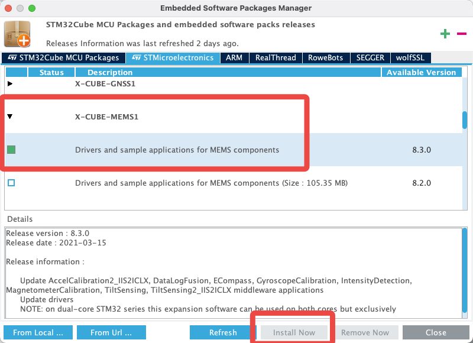

# FunPack第九期

本期FunPack给我们带来的是一块来自意法半导体的EVAL板卡SensorTile.Box(STEVAL-MKSBOX1V1)。

这是一块基于STM32L4R9ZIJx的一块开发板，板载了丰富的传感器。同时，作为ST自家的板子，Cube和Algo等软件的适配也非常棒，使用起来极其方便。较为可惜的是，网上（包括ST自家官网）对如何使用X-Cube扩展来配置板载传感器的教程较少，所以本次我将使用STM32CubeMX来完成任务。

## 任务清单

本次我选择的是任务二：

搭建可随身携带的环境监测系统，记录一段时间的环境数据，并导出查看(要求解释数据的变化）

## 任务分析

* 环境监测系统可使用板载温湿度传感器和气压传感器获取信息
* 可随声携带可使用随机自带的锂电池进行供电
* 记录一段时间的环境数据可存放在随机自带的MicroSD卡中

## 代码部分

本次选择使用STM32CubeMX配合CLion开发

### 初始化外设

由于是ST自家评估板，直接从CubeMX的Board Selector中选择即可默认初始化板载外设。需要注意的是，默认未开启14PinJTAG的串口，可开启USART1并使用默认管脚即可


### 导入软件包

首先下载软件包




然后导入


根据板载传感器选择X-Cube软件包


然后就能看到我们添加的包了，根据连接方式配置一下


生成代码即可

### X-Cube软件包的调用

读取传感器信息的细节ST都给你封装好了，我们只需要初始化后读取即可（是不是有点像Arduino2333）

```c++
// 初始化传感器
CUSTOM_ENV_SENSOR_Init(CUSTOM_HTS221_0, ENV_TEMPERATURE);
CUSTOM_ENV_SENSOR_Init(CUSTOM_HTS221_0, ENV_HUMIDITY);
CUSTOM_ENV_SENSOR_Init(CUSTOM_LPS22HH_0, ENV_PRESSURE);
// 读取传感器数据
float temperature;
CUSTOM_ENV_SENSOR_GetValue(CUSTOM_HTS221_0, ENV_TEMPERATURE, &temperature);
float humidity;
CUSTOM_ENV_SENSOR_GetValue(CUSTOM_HTS221_0, ENV_HUMIDITY, &humidity);
float pressure;
CUSTOM_ENV_SENSOR_GetValue(CUSTOM_LPS22HH_0, ENV_PRESSURE, &pressure);
```

### RTC的使用

给传感器数据加一个时间戳是个不错的选择。

Cube默认配置已经帮我们配置好了RTC，直接使用即可。

```c++
RTC_TimeTypeDef time;
RTC_DateTypeDef date;
HAL_RTC_GetTime(&hrtc, &time, RTC_FORMAT_BIN);
HAL_RTC_GetDate(&hrtc, &date, RTC_FORMAT_BIN);
```

需要注意的是，`HAL_RTC_GetDate`函数不可省略，否则会导致`HAL_RTC_GetTime`只能读取到一次数据，具体原因暂未知。

### MicroSD卡的写入

同样的，Cube的默认配置已经帮我们初始化好了SD卡和FatFS，我们只需要调用其中的接口即可。我们本次使用csv格式的文件来记录数据。csv格式比较方便，使用逗号和换行即可分隔数据。

```c++
// 新建文件并写入标题栏
FRESULT fr = f_open(&SDFile, "data.csv", FA_CREATE_ALWAYS | FA_WRITE);
UINT num;
sprintf(ch, "time,temperature,humidity,pressure\n");
fr = f_write(&SDFile, ch, strlen(ch), &num);
fr = f_close(&SDFile);
// 写入传感器数据
sprintf(ch, "%d:%d:%d,%f,%f,%f\n", (int) time.Hours, (int) time.Minutes, (int) time.Seconds, temperature,humidity, pressure);
UINT num;
f_open(&SDFile, "data.csv", FA_OPEN_APPEND | FA_WRITE);
f_write(&SDFile, ch, strlen(ch), &num);
f_close(&SDFile);
```

## 测试数据及分析

测得一段时间以及使用吹风机加热后的温湿度和气压数据如下：（左边为sd卡中存储的数据，右边为串口发送到电脑的数据）


将数据图形化后：


可以观察到使用吹风机加热后的数据变化：温度升高、湿度降低、气压没有什么变化

## 心得体会

ST确实做了很多的好用的工具，STM32CubeMX谁用谁说好。可是在国内的推广力度有时候不太够，资料有时候也不太多。就比如说这期我才知道的流程图编程软件Algo，还有我找了半天也没怎么找到使用说明的X-Cube软件包。

